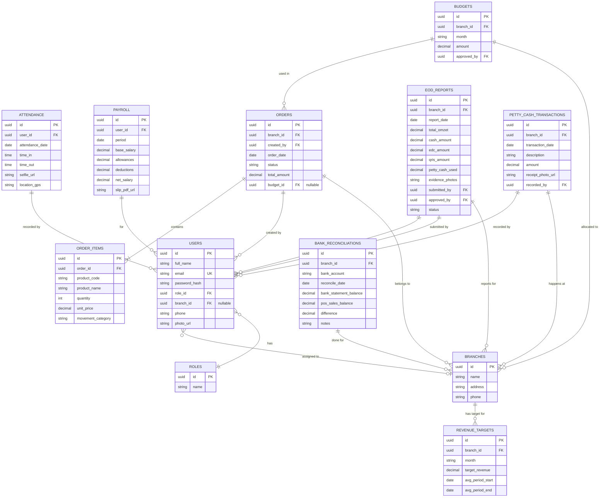

# PRD — Project Requirements Document: ERP Mirraya Cosmetics (Olsera POS Integrated)

## 1. Overview
Mirraya Cosmetics adalah toko retail kosmetik dengan 6 cabang dan ~60 karyawan. Saat ini absensi, penggajian, pelaporan keuangan, dan manajemen stok dilakukan terpisah dan manual, sehingga koordinasi lambat dan keputusan sering berdasarkan intuisi. Aplikasi ERP ini menyatukan seluruh proses bisnis dalam satu sistem yang terhubung langsung dengan API POS Olsera sebagai sumber data penjualan dan inventaris.

Tujuan utama:
- Memberikan pengalaman kerja yang efisien bagi setiap peran (Owner, HR, Accounting, Kepala Toko, BA/karyawan) sesuai tugasnya.
- Menyajikan laporan keuangan dan operasional terintegrasi lintas cabang secara real-time.
- Membantu pemilik mengambil keputusan berbasis data (data-driven) dengan dukungan analisis AI.
- Memantau performa penjualan per cabang melalui target omzet bulanan yang dihitung otomatis, lengkap dengan persentase pencapaian dan selisih nominal.

## 2. Requirements
- **Multi-role & multi-cabang** – 5 peran (Owner, HR, Accounting, Kepala Toko, BA) dengan hak akses dan tampilan berbeda.
- **Integrasi POS Olsera** – Otomatis mengambil data penjualan, produk (nama, HPP, harga jual, stok), dan omzet melalui API Olsera.
- **Absensi berbasis lokasi & selfie** – Check-in/out wajib menyertakan foto selfie dan titik GPS. Rekap dapat difilter per tanggal, cabang, atau individu.
- **Payroll terpusat** – Hitung gaji dari data absensi dan komponen tunjangan/potongan; slip gaji PDF yang dapat diunduh.
- **Manajemen HR** – CRUD akun pengguna, cabang, dan riwayat perubahan; tampilan daftar karyawan terpusat dengan kemampuan filter dan lihat detail (profil, foto absensi, GPS).
- **Accounting terintegrasi**  
  - CRUD manual: jurnal penyesuaian, petty cash, rekonsiliasi bank, koreksi laba-rugi.  
  - Laporan laba-rugi, arus kas per cabang, monitoring petty cash, pengeluaran operasional.  
  - Pengelolaan anggaran cabang (buat, edit, hapus) oleh accounting; kepala toko hanya melihat sisa anggaran (read-only).  
  - Persetujuan EOD dan purchase order (PO).
- **Budgeting & ordering** – Kepala toko mengajukan PO berdasarkan analisis fast/slow moving; sistem merekomendasikan jumlah pesanan.
- **EOD harian** – Kepala toko mencatat omzet, metode pembayaran, penggunaan petty cash + bukti foto; wajib disetujui accounting.
- **Inventaris real-time per cabang** – Kepala toko melihat nama produk, HPP, harga jual, stok (dari API Olsera, read-only).
- **Dashboard Owner berbasis AI** – Grafik perbandingan cabang, produk terlaris/kurang laku, insight AI yang dapat ditindaklanjuti.
- **Target Revenue Tracking** – Target omzet bulanan dihitung otomatis dari rata-rata historis; dashboard menampilkan target vs realisasi, % capaian, selisih nominal.
- **Filter & ekspor** – Semua data (absensi, laporan, order) dapat difilter (tanggal, cabang) dan diekspor ke PDF/CSV.
- **Progressive Web App (PWA)** – Wajib dapat diinstal di layar beranda (mobile/desktop) tanpa toko aplikasi. Dukungan kamera & geolokasi penuh, caching halaman absensi untuk akses cepat, dan service worker agar tetap bisa dibuka saat offline.

## 3. Core Features
- **Autentikasi multi-role** – Login dengan email & password; menu otomatis menyesuaikan role.
- **Modul Absensi**  
  - Check-in/out dengan selfie + GPS.  
  - Riwayat kehadiran bisa difilter (tanggal, jam, cabang, gabungan).  
  - HR dapat melihat riwayat absensi semua karyawan, mencari nama, filter detail, dan **Lihat Detail** (pop-up profil + foto selfie + lokasi).  
  - BA hanya melihat riwayat sendiri.
- **Modul HR & Master Data**  
  - Daftar karyawan terpusat (semua cabang) dengan fitur cari & filter.  
  - CRUD karyawan (tambah, edit, nonaktifkan, unggah data diri) langsung dari daftar.  
  - Kelola cabang (tambah, ubah, hapus).  
  - Slip gaji PDF per periode.  
  - Owner juga dapat mengakses Lihat Detail profil karyawan.
- **Modul Accounting**  
  - CRUD data keuangan (jurnal, petty cash, rekonsiliasi) secara manual.  
  - Laporan laba-rugi & arus kas otomatis + penyesuaian, per cabang dan konsolidasi.  
  - Rekonsiliasi bank: bandingkan saldo bank vs data penjualan.  
  - Kelola anggaran cabang (buat, ubah, hapus); ringkasan pemakaian & sisa.  
  - Approve/reject PO dan EOD.  
  - Monitor target omzet cabang (target, realisasi, % capaian, selisih).
- **Modul Kepala Toko**  
  - Ajukan PO: pilih produk, jumlah, catatan; dapat rekomendasi fast/slow.  
  - Lihat anggaran bulan ini & sisa (read-only).  
  - Inventory produk cabang sendiri (Nama, HPP, Harga Jual, Stok) dari Olsera, tanpa aksi ubah.  
  - EOD: isi omzet, tunai, EDC, QRIS, petty cash + unggah foto.
- **Modul Owner (All Access)**  
  - Dashboard perbandingan omzet & performa semua cabang.  
  - Produk fast/slow moving.  
  - Insight AI: saran stok, promosi, efisiensi.  
  - Pemantauan target omzet: grafik target vs realisasi, highlight cabang di bawah target.  
  - Akses penuh untuk edit data dan Lihat Detail karyawan.
- **PWA fundamental**  
  - Prompt instalasi “Tambahkan ke Layar Utama” saat pertama dibuka.  
  - Ikon & splash screen merek Mirraya.  
  - Service worker caching halaman absensi agar tetap bisa dibuka; pengiriman data offline-to-sync direncanakan untuk rilis berikutnya.

## 4. User Flow
1. **Login** – Pengguna membuka aplikasi via browser/PWA, masuk menggunakan email & password.
2. **Role-based Routing** – Sistem membaca role, mengarahkan ke dashboard sesuai:
   - Owner → Dashboard perbandingan cabang, AI insight, target omzet.
   - Accounting → Laporan, kelola anggaran, EOD, target omzet.
   - HR → Manajemen karyawan & absensi, payroll.
   - Kepala Toko → Order, inventory, EOD, lihat anggaran.
   - BA → Absensi & slip gaji.
3. **Instalasi PWA** – Pengguna baru mendapat banner untuk menambahkan ke layar beranda. Setelah terinstal, aplikasi berjalan layar penuh dengan akses kamera & GPS optimal.
4. **Alur Kepala Toko**  
   a. Lihat anggaran bulan ini & sisa di menu Budgeting.  
   b. Cek stok & harga produk (dari Olsera) di menu Inventory.  
   c. Buat PO dengan rekomendasi sistem, ajukan untuk disetujui accounting.  
   d. Setelah tutup toko, isi EOD (omzet, metode bayar, petty cash, unggah foto bukti).
5. **Alur Accounting** – Verifikasi & approve EOD; kelola jurnal manual, petty cash, rekonsiliasi bank; atur anggaran cabang; monitor target omzet.
6. **Perhitungan Target Omzet** – Awal bulan, cron job menghitung rata-rata omzet historis (3 bulan terakhir) per cabang dan menyimpan target baru. Owner & accounting melihat dashboard capaian, cabang di bawah target ditandai merah dengan selisih nominal.
7. **Payroll** – HR menjalankan perhitungan gaji bulanan; slip otomatis tersimpan dan dapat diunduh karyawan.
8. **Monitoring Absensi HR** – HR membuka Riwayat Absensi, filter sesuai kebutuhan, klik “Lihat Detail” untuk melihat profil lengkap + foto selfie + GPS.
9. **Owner Insight** – Owner mengakses dashboard, membaca saran AI, dan dapat langsung mengubah alokasi stok atau mengambil keputusan lain.
10. **Karyawan (BA)** – Hanya melihat riwayat absensi sendiri, tanpa akses detail profil rekan kerja.

## 5. Architecture
Sistem berbasis web dengan dukungan penuh PWA. Frontend Next.js App Router menyajikan antarmuka; service worker menangani caching untuk performa dan ketahanan offline. Backend menggunakan Next.js API Routes, terhubung ke PostgreSQL via Drizzle ORM, dan mengonsumsi REST API POS Olsera. Better Auth mengelola sesi dan role-based access control.

```mermaid
flowchart TD
    A[Perangkat Pengguna\nBrowser / PWA Terinstal] -->|HTTPS| SW[Service Worker\n(Cache & Offline Support)]
    A -->|Manifest| M[Web App Manifest\n(ikon, splash, orientasi)]
    SW --> B[Next.js Frontend\n(Tailwind + shadcn)]
    B --> C[Next.js API Routes\n/api/*]
    C --> D[Drizzle ORM\n(PostgreSQL)]
    C --> E[POS Olsera REST API]
    E --> F[(Database Olsera)]
    D --> G[(Database ERP)]
    C --> H[Better Auth\n(session & RBAC)]
```

- **Frontend** – Hanya mengirim request ke API internal. PWA dikelola `next-pwa`, manifest dikustomisasi dengan ikon Mirraya dan tema rose gold.
- **Backend (API Routes)** – Validasi role via Better Auth, bisnis logik, penyimpanan ke database ERP, dan pengambilan data dari Olsera.
- **Database ERP** – PostgreSQL, seluruh tabel dikelola Drizzle ORM.
- **Service Worker** – Caching strategis (stale-while-revalidate) untuk halaman absensi; tetap bisa dibuka meski jaringan lemah. Data offline dikirim saat koneksi pulih (mendatang).
- **Cron Job** – Scheduled task (Vercel Cron / GitHub Actions) menghitung target omzet bulanan di awal bulan.

## 6. Database Schema
Tabel utama yang disimpan di database ERP. Data penjualan dan inventaris produk diambil langsung dari API Olsera; tidak diduplikasi kecuali untuk cache performa.

### Tabel Inti
| Tabel | Deskripsi | Kolom Penting |
|-------|-----------|---------------|
| `users` | Akun seluruh pengguna | `id` (uuid PK), `full_name`, `email`, `password_hash`, `role_id` (FK), `branch_id` (FK nullable untuk multi-cabang), `phone`, `photo_url` |
| `roles` | Daftar role (owner, hr, accounting, store_leader, ba) | `id` (uuid PK), `name` |
| `branches` | Data cabang | `id` (uuid PK), `name`, `address`, `phone` |
| `attendance` | Rekaman absensi harian | `id` (uuid PK), `user_id` (FK), `attendance_date`, `time_in`, `time_out`, `selfie_url`, `location_gps` |
| `payroll` | Slip gaji bulanan | `id` (uuid PK), `user_id` (FK), `period`, `base_salary`, `allowances`, `deductions`, `net_salary`, `slip_pdf_url` |
| `budgets` | Anggaran bulanan cabang | `id` (uuid PK), `branch_id` (FK), `month`, `amount`, `approved_by` (FK) |
| `orders` | Purchase order (PO) | `id` (uuid PK), `branch_id` (FK), `created_by` (FK), `order_date`, `status`, `total_amount`, `budget_id` (FK nullable) |
| `order_items` | Item dalam PO | `id` (uuid PK), `order_id` (FK), `product_code`, `product_name`, `quantity`, `unit_price`, `movement_category` |
| `eod_reports` | Laporan tutup hari (End of Day) | `id` (uuid PK), `branch_id` (FK), `report_date`, `total_omzet`, `cash_amount`, `edc_amount`, `qris_amount`, `petty_cash_used`, `evidence_photos` (JSON), `submitted_by` (FK), `approved_by` (FK), `status` |
| `petty_cash_transactions` | Transaksi kas kecil | `id` (uuid PK), `branch_id` (FK), `transaction_date`, `description`, `amount`, `receipt_photo_url`, `recorded_by` (FK) |
| `bank_reconciliations` | Data rekonsiliasi bank | `id` (uuid PK), `branch_id` (FK), `bank_account`, `reconcile_date`, `bank_statement_balance`, `pos_sales_balance`, `difference`, `notes` |
| `revenue_targets` | Target omzet bulanan cabang | `id` (uuid PK), `branch_id` (FK), `month`, `target_revenue`, `avg_period_start`, `avg_period_end` |

### Entity Relationship Diagram

7# Dokumentasi Skema Warna - Mirraya ERP

Berdasarkan analisis visual dari screenshot desain landing page **Mirraya ERP**, skema warna yang digunakan mengusung tema **Modern, Clean, dan Profesional** dengan pendekatan *light mode* (latar belakang dominan putih/terang).

Berikut adalah rincian palet warna yang digunakan beserta peranannya dalam desain:

---

## 1. Warna Utama & Identitas Merek (Primary Colors)
Warna-warna ini mendominasi elemen penting (*Call to Action* / CTA) dan menjadi identitas visual dari Mirraya.

### Deep Magenta / Vibrant Pink (Warna Hero)
* **Peran:** Digunakan untuk teks sorotan penting (seperti tulisan "Mirraya Cosmetics" pada H1), tombol utama (*Login to Dashboard*), logo, serta aksen teks link aktif.
* **Kesan:** Energik, modern, dan sangat erat kaitannya dengan industri *beauty/cosmetics*.

### Dark Navy Blue / Hampir Hitam
* **Peran:** Digunakan untuk teks utama seperti judul (H1 & H2) dan teks menu navigasi.
* **Kesan:** Memberikan kontras yang kuat agar teks sangat mudah dibaca, namun lebih lembut di mata dibandingkan warna hitam pekat (`#000000`).

---

## 2. Warna Latar Belakang & Netral (Background & Neutral Colors)
Warna yang menjaga desain tetap terlihat bersih, rapi, dan memberikan ruang bernapas (*whitespace*).

### Putih Bersih (`#FFFFFF`)
* **Peran:** Latar belakang utama halaman, warna latar kartu fitur (*feature cards*), dan warna teks di dalam tombol utama.

### Soft Gray / Off-White (Abu-abu Sangat Muda)
* **Peran:** Digunakan sebagai warna latar belakang komponen pada mockup dasbor dan beberapa elemen dekoratif halus untuk memisahkan area konten.

---

## 3. Warna Aksen & Indikator (Accent & Soft Colors)
Warna-warna ini digunakan secara minimalis pada ikon di bagian grid fitur untuk membedakan fungsi tiap kategori sekaligus memberikan variasi visual agar tidak membosankan. Setiap ikon menggunakan kombinasi **warna solid** dan **latar belakang transparan (soft)** dari warna yang sama:

* **Biru Muda (Soft Blue):** Digunakan pada ikon *Multi-role & Multi-cabang* (memberikan kesan korporat/struktur).
* **Hijau (Soft Green):** Digunakan pada ikon *Integrasi POS Olsera* (identik dengan operasional dan finansial/penjualan).
* **Merah Muda (Soft Pink):** Digunakan pada ikon *Absensi Selfie & GPS* serta latar belakang tag "Terintegrasi dengan Olsera POS".
* **Oranye/Kuning (Soft Orange):** Digunakan pada ikon *Insight AI untuk Owner* (identik dengan kreativitas dan teknologi cerdas).
* **Ungu (Soft Purple):** Digunakan pada ikon *Accounting & Payroll Terpusat* (memberikan kesan mewah dan sistematis).
* **Sian/Toska (Soft Cyan):** Digunakan pada ikon *Target Revenue Tracking* (memberikan kesan target, fokus, dan pertumbuhan).

---

## 4. Warna Teks Sekunder (Typography Colors)
### Charcoal Gray (Abu-abu Tua)
* **Peran:** Digunakan untuk seluruh teks deskripsi/paragraf di bawah judul dan teks hak cipta pada footer.
* **Kesan:** Mengurangi ketegangan mata saat membaca deskripsi panjang dibandingkan jika menggunakan warna hitam pekat.

---

## Ringkasan Strategi Pewarnaan
Desain ini menerapkan aturan **60-30-10**:
* **60%** didominasi warna netral terang (Putih & Abu-abu muda) untuk kebersihan tata letak.
* **30%** diisi oleh warna teks gelap (Navy/Charcoal) untuk keterbacaan struktur informasi.
* **10%** adalah warna *Vibrant Pink/Magenta* dan warna-warna aksen ikon yang berfungsi menarik perhatian mata pengguna (*focal point*) langsung ke tombol navigasi dan fitur penting.